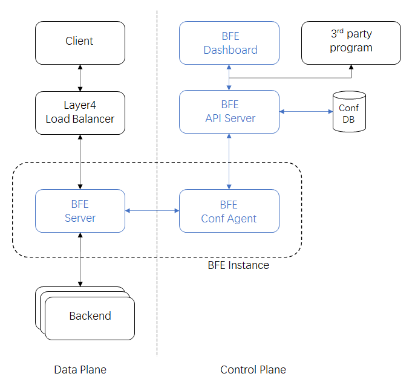

# Overview

## What is BFE

BFE is an open-source layer 7 load balancer derived from proprietary Baidu Front End.

## Features and Advantages

* Written in Golang

BFE is written in a memory safety language and immune to Buffer Overflow vulnerability; BFE recovers from the runtime panics and handles them appropriately without killing the BFE process; BFE runs on Linux, Windows, Mac OS and almost anything to which Go compiles.

* Flexible plugin framework

BFE has a builtin plugin framework that makes it possible to develop new features rapidly by writing plugins.

* Multi-tenancy architecture

BFE is designed to provide every tenant a dedicated share of the instance. Each tenant’s configuration is isolated and remains invisible to other tenants.

* Multiple protocols supported

BFE supports HTTP, HTTPS, SPDY, HTTP2, WebSocket, TLS, gRPC, FastCGI, etc. Future support is planned for HTTP/3.

* Content based routing

BFE provides an [advanced domain-specific language](../condition/condition_grammar.md) to describe routing rules which are easy to understand and maintain.

* Advanced load balancing

BFE supports global load balancing and distributed load balancing for zone aware balancing, zone level failure resilience, overload protection etc.

* A rich set of builtin plugins

BFE provides a rich set of plugins for traffic management, security, observability, etc.

* Best-in-class observability

BFE includes detailed built-in metrics for all subsystems. BFE writes various logs(server log/access log/TLS key log) for trouble shooting, data analysis and visualization. BFE also supports distributed tracing.

* Easily integrated with ecosystem projects

BFE is easily integrated with mainstream layer 4 load balancing solution, and other ecosystem projects(e.g. Kubernetes、Prometheus、Jaeger、Fluentd etc).

## Components

BFE system consists of components in both data plane and control plane:

- Data plane：
  - BFE Server：BFE forward engine. BFE Server performs content based routing, load balancing and forwards the traffic to backend servers.
- Control plane：
  - [BFE API Server](https://github.com/bfenetworks/api-server)：provides API and handles update, storage and generation of BFE config
  - [BFE Conf Agent](https://github.com/bfenetworks/conf-agent)：component for loading config, fetches latest config from API-Server and triggers BFE Server to reload it
  - [BFE Dashboard](https://github.com/bfenetworks/dashboard)：provides a graphic interface for user to manage and view major config of BFE

## Architecture overview

This diagram illustrates the architecture of BFE and some of its ecosystem components:

### Data plane

The incoming user traffic reaches the BFE server through the Layer 4 load balancing facilities. During the processing of user traffic, BFE routes each HTTP request to a target cluster based on request content (URI, header, cookie, etc), and then choose the best backend server instance from the target cluster based on the load balancing policy. For more details about traffic forwarding process, see [Traffic forwarding model](forward_model.md).

### Control plane

The control plane is responsible for management and configuration of BFE system, which can be maintained via BFE Dashboard or RESTful API. BFE Conf Agent will trigger BFE Server to load the latest configuration.
