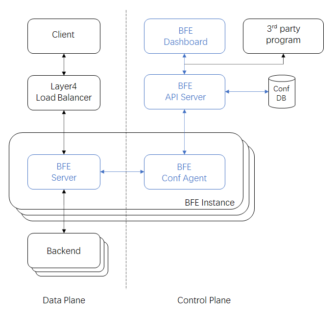

# Overview

## What is BFE

BFE is an open-source layer 7 load balancer derived from proprietary Baidu Front End. 

## Features and Advantages

* Written in Golang

BFE is written in a memory safety language and immune to Buffer Overflow vulnerability; BFE recovers from the runtime panics and handles them appropriately without killing the BFE process; BFE runs on Linux, Windows, Mac OS and almost anything to which Go compiles.

* Flexible plugin framework 

BFE has a builtin plugin framework that makes it possible to develop new features rapidly by writing plugins.

* Multi-tenancy architecture

BFE is designed to provide every tenant a dedicated share of the instance. Each tenant’s configuration is isolated and remains invisible to other tenants.

* Multiple protocols supported

BFE supports HTTP, HTTPS, SPDY, HTTP2, WebSocket, TLS, gRPC, FastCGI, etc. Future support is planned for HTTP/3.

* Content based routing

BFE provides an [advanced domain-specific language](../condition/condition_grammar.md) to describe routing rules which are easy to understand and maintain. 

* Advanced load balancing

BFE supports global load balancing and distributed load balancing for zone aware balancing, zone level failure resilience, overload protection etc. 

* A rich set of builtin plugins 

BFE provides a rich set of plugins for traffic management, security, observability, etc.

* Best-in-class observability

BFE includes detailed built-in metrics for all subsystems. BFE writes various logs(server log/access log/TLS key log) for trouble shooting, data analysis and visualization. BFE also supports distributed tracing.

* Easily integrated with ecosystem projects

BFE is easily integrated with mainstream layer 4 load balancing solution, and other ecosystem projects(e.g. Kubernetes、Prometheus、Jaeger、Fluentd etc).

## Components

The BFE ecosystem consists of multiple components, many of which are optional:

* BFE-Server: The Layer 7 Load Balancer for data plane (open source）

* BFE-Reader: The Log analyzer is deployed locally with BFE-Server and aggregates logs to reduce the data size of subsequent processing on BFE-Aggregator.

* BFE-API Server: The API server is the front end for the BFE control plane.

* BFE-Aggregator: The Log aggregator aggregates data from BFE-Reader in real time.

* BFE-Scheduler: The GSLB scheduler automatically computes GSLB policies based on incoming traffic, backend capacity, network topology and quality.

* BFE-Controller: BFE cluster controller for normal management tasks (e.g. anomaly detection and alerting).

* BFE-Web UI: Web console for BFE.

* Various support systems, eg. cache service, asymmetric cryptographic service etc.

## Architecture overview

This diagram illustrates the architecture of BFE and some of its ecosystem components:

### Data plane

The incoming user traffic reaches the BFE server through the Layer 4 load balancing facilities. During the processing of user traffic, BFE may interact with various dependent services. BFE routes each HTTP request to a target cluster based on request content (URI, header, cookie, etc), and then choose the best backend instance from the target cluster based on the load balancing policy. For more details about traffic forwarding process, see [Traffic forwarding model](forward_model.md).

### Control plane

The control plane provides policies and configurations of data plane, which are maintained via BFE-Web UI or BFE-API by the administrator. The control plane also makes global decisions about the cluster (for example, scheduling), as well as cluster level management tasks (for example, detecting and responding to cluster abnormal events).

