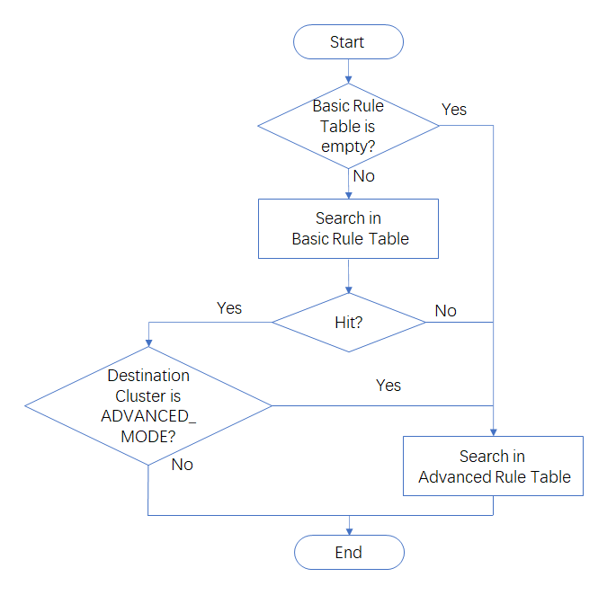

# Traffic Routing

## Overview

- In BFE [forwarding model](./forward_model.md), after "product name" for one request is determined, the destination cluster should be specified.
- BFE provides a Forwarding Table for each product.
- For each request, the forwarding table for the determined product is searched, and destination cluster is specified.

## Composition of Forwarding Table

A Forwarding Table is composed of two parts:

- **Basic Rule Table**, consists of  "Basic Rules". BFE searches "host" and/or "path" conditions to match a Basic Rule.  
- **Advanced Rule Table**,  consists of  "Advanced Rules". It's searched in listed order (from up to down). Various request contents (including host, path, header, cookie, method, etc) can be used in search to match conditions in advanced rules. A Default Rule should be configured in Advanced Rule Table, as the last resort.

Basic Rule Table uses tree search and can be searched fast, even with large amount (thousands, for example) of rules configured. Advanced Rule Table has more powerful condition  description capability, but its search performance may degrades when number of rules is large ( >100 rules, for example).

## Steps of search

- BFE will search in Basic Rule Table first, then Advanced Rule Table, to specify the destination cluster for a request.
- If required, destination cluster of a Basic Rule can be set to "ADVANCED_MODE". If such a rule is hit, BFE will continue to search in the Advanced Rule Table for this request.
- Detailed steps of search are described as below.



## Basic Rule Table

### Introduction

**Basic Rule Table** consists of several "Basic Rules".

Each Basic Rule includes one or both of two conditions:  Host and Path.

Destination Cluster is specified by a cluster name, or keyword "ADVANCED_MODE" which indicates to continue searching in Advanced Rule Table.

There's no order among Basic Rules.  The matched rule with most specific condition will take precedence. See details in "Search in Basic Rule Table".

### Conditions of Basic Rule Table

For each Basic Rule, at least one of two conditions (Host and Path) should be configured.

**Host** condition description's syntax is as follow:

- Use "." to split labels within a host name
- Support "Exact Match", "Wildcard Match", "Any Match"
  - Exact Match: An exact hostname (for example "www.test1.com")
  - Wildcard Match: A host name with first label set to "\*". The "\*" can only appear once in a hostname and only covers a single label (for example "\*.test1.com"). Examples of invalid host condition description include "\*est.com" and "\*.\*.com".
  - Any Match: A special Wildcard Match. Standalone "\*" can match any host. (A standalone "\*" here can cover a hostname with multiple labels, which is different from Wildcard Match.)
- Host condition of a Basic Rule supports multiple host condition descriptions (for example: "www.test1.com,","\*.example.com").

**Examples:**

| Host Condition | Host in a request  | Match？                                   |
| -------------- | ------------------ | ----------------------------------------- |
| \*             | www.test1.com      | Match                                     |
| \*.test1.com   | host.test1.com     | Match                                     |
| \*.test1.com   | vip.host.test1.com | No Match, "\*" only covers a single label |
| \*.test1.com   | example.com        | No Match                                  |
| \*.test1.com   | test1.com          | No Match                                  |

**Path** condition description's syntax is as follow:

- Use "/" to split elements within a path
- Start with "/", except for a standalone "\*".
- Support "Exact Match", "Prefix Match", "Any Match"
  - Exact Match: An exact path (for example "/foo")
  - Prefix Match: A path prefix followed by a "\*" means it's a prefix match. It compares element by element from the left. The "\*" can only appear once, and can covers one or multiple consecutive path elements. A standalone "\*" is also a prefix match. Examples:
    - both /\* and /foo/\* can match path /foo/bar
    - /foo/* is equivalent to  /foo\*
    - /foo/b\* can not match /foo/bar
    - /\*/\* is not a valid path condition description
- Path condition of a Basic Rule supports multiple path condition descriptions (for example: "/foo/bar", "/foo/cell/\*").

**Examples:**

| Path Condition                 | Path in the request | Match?                                              |
| ------------------------------ | ------------------- | --------------------------------------------------- |
| \*                             | Any path            | Match                                               |
| /                              | Empty               | No match                                            |
| /                              | /a                  | No match                                            |
| /\*                            | Empty               | No match                                            |
| /\*                            | /                   | Match, \* can match null                            |
| /\*                            | /a/                 | Match, ignores trailing slash                       |
| /a/b/\* (equivalent to /a/b\*) | /a/b/c              | Match                                               |
| /a/b/\* (equivalent to /a/b\*) | /a/b/c/d            | Match, \* covers multiple consecutive path elements |
| /a/b/\* (equivalent to /a/b\*) | /a/b                | Match, ignores trailing slash and \* can match null |
| /a/b/\* (equivalent to /a/b\*) | /a/c                | No match                                            |
| /a/b/\* (equivalent to /a/b\*) | /a/                 | No match                                            |
| /a/b\*                         | /a/bacon            | No match                                            |

### Search in Basic Rule Table

When search in Basic Rule Table, BFE will search the host condition first, then search the path condition in rules that match the host.

Detailed steps of search in Basic Rule Table are described below:

1. First, search host condition using **Exact Match**
   - For rules that match (may be one or multiple rules), search path condition of them;
     - If a rule matches the path, the rule is hit;
     - If no rule matches path, then search in Basic Rule Table ends and BFE will continue to search in Advanced Rule Table.
2. If no rule matches as host Exact Match, search host condition using **Wildcard Match**
   - For rules that match (may be one or multiple rules), search path condition of them;
     - If a rule matches the path, the rule is hit;
     - If no rule matches path, then search in Basic Rule Table ends and BFE will continue to search in Advanced Rule Table.
3. If no rule matches as host Wildcard Match, search host condition using **Any Match**
   - For rules that match (may be one or multiple rules), search path condition of them;
     - If a rule matches the path, the rule is hit;
     - If no rule matches path, then search in Basic Rule Table ends and BFE will continue to search in Advanced Rule Table.
4. Search in Basic Rule Table ends. If no rule matches, BFE will continue to search in Advanced Rule Table.

Among above steps, when searching path condition in rules that has matches the host:

1. Search path condition using **Exact Match**
2. If no rule matches as Exact Match, search path condition using **Prefix Match**. Precedence will be given to the longest matching path. So if more than one rule matches the path in the request, the rule with most matching path elements is hit.

### Examples

Four Basic Rules are configured, as below:

- Rule1：**host condition**：\*.test1.com，**path condition**：empty，**Destination Cluster**：StaticCluster
- Rule2：**host condition**：\*.b.test1.com，**path condition**：/interface/\* ，**Destination Cluster**：PhpCluster
- Rule3：**host condition**：\*.b.test1.com， **path condition**：/\*， **Destination Cluster**：StaticCluster
- Rule4：**host condition**：www.test1.com， **path condition**：/interface/d， **Destination Cluster**：PhpCluster

A request arrives, with its URL="vip.b.test1.com/interface/d"

BFE searches host condition first：

1.**Exact Match** for host, no match

2.**Wildcard Match** for host, both Rule2 and Rule3 match host (vip.b.test1.com) of the request (Notice, Rule1 does not match this host, as wildcard "\*" only covers a single label)

Then BFE searches path condition：

1.**Exact Match** for path, no match

2.**Prefix Match** for path, both Rule2 and Rule3 match the path (/interface/d) of the request. And Rule2 has precedence as it has more matching path elements than Rule3.

Search ends and Rule2 is hit. Request will be forwarded to cluster PhpCluster as specified in Rule2.

## Advanced Rule Table

Advanced Rule Table consists of one or more "Advanced Rules" which have an order.

- Condition of a Advanced Rule is described using a pseudocode description called "[Condition Expression](https://www.bfe-networks.net/en_us/condition/condition_grammar/)".
- Destination Cluster is specified by a cluster name.

When searching in Advanced Rule Table, the rules are searched from up to down, in listed order:

- Try to match the condition of the rule with information in the HTTP request (such as host，path，query，cookie，method). If it  matches, the rule is hit.  
- If a rule is hit, the search stops.
- A Default Rule must be configured in the Advanced Rule Table. If no other rule matches a request, the Default Rule is hit.

## Examples

- A product "demo" has several clusters: Demo-A, Demo-B, Demo-C, Demo-D，Demo-E

- The expected route is as below:
  + Requests with host=www.a.com and path="/a/\*" (except "/a/b"), forwarded to  Demo-A
  + Requests with host=www.a.com and path="/a/b", forwarded to Demo-B
  + Other requests with host=\*.a.com, forwarded to Demo-C
  + Requests with host=www.c.com, forwarded to Demo-D
  + For Demo-D, another cluster Demo-D1 is created for a canary release.  For requests with host=www.c.com and cookie "deviceid" with its value starting with "x", forwarded to cluster Demo-D1
  + All the other requests, forward to Demo-E

- In this case, the **Basic Rule Table** can be configured as below:

| Host condition | Path condition | Destination Cluster |
| -------------- | -------------- | ------------------- |
| www.a.com      | /a/\*          | Demo-A              |
| www.a.com      | /a/b           | Demo-B              |
| \*.a.com       | *              | Demo-C              |
| www.c.com      | *              | ADVANCED_MODE       |

There's no order for Basic Rules. Refer to "Search in Basic Rule Table" above.

As cookie information is need for the canary release of applications on Demo-D, the rule uses ADVANCED_MODE to do further search in Advanced Rule Table for related requests. If canary release is not required, the Destination Cluster of this rule can be set to Demo-D.

- The **Advanced Rule Table** can be configured as below:

| Conditions                                                   | Destination Cluster |
| ------------------------------------------------------------ | ------------------- |
| req_host_in ("www.c.com") && req_cookie_value_prefix_in ("deviceid", "x", false) | Demo-D1             |
| req_host_in ("www.c.com")                                    | Demo-D              |
| default                                                      | Demo-E              |

Advanced Rules are searched from up to down. Rule for Demo-D1 should be placed before rule for Demo-D.

Default Rule is configured in Advanced Rule Table. Requests that do not hit any other rule will be forwarded to Demo-E.

For above configuration, configuration file (/conf/server_data_conf/route_rule.conf) is as follows:

```
{
    "Version": "1.0",
    "BasicRule": {
        "demo": [
            {
                "Hostname": ["www.a.com"],
                "Path": ["/a/*"], 
                "ClusterName": "Demo-A"
            },
            {
                "Hostname": ["www.a.com"],
                "Path": ["/a/b"],
                "ClusterName": "Demo-B"
            },
            {
                "Hostname": ["*.a.com"],
                "Path": "*",
                "ClusterName": "Demo-C"
            },
            {
                "Hostname": ["www.c.com"],
                "Path": "*",
                "ClusterName": "ADVANCED_MODE"
            }
        ]
    },
    "ProductRule": {
        "demo": [
            {
                "Cond": " req_host_in(\"www.c.com\") && req_cookie_value_prefix_in(\"deviceid\", \"x\", false)",
                "ClusterName": "Demo-D1"
            },
            {
                "Cond": " req_host_in(\"www.c.com\")",
                "ClusterName": "Demo-D"
            },
            {
                "Cond": "default_t()",
                "ClusterName": "Demo-E"
            }
        ]
    }    
}
```
