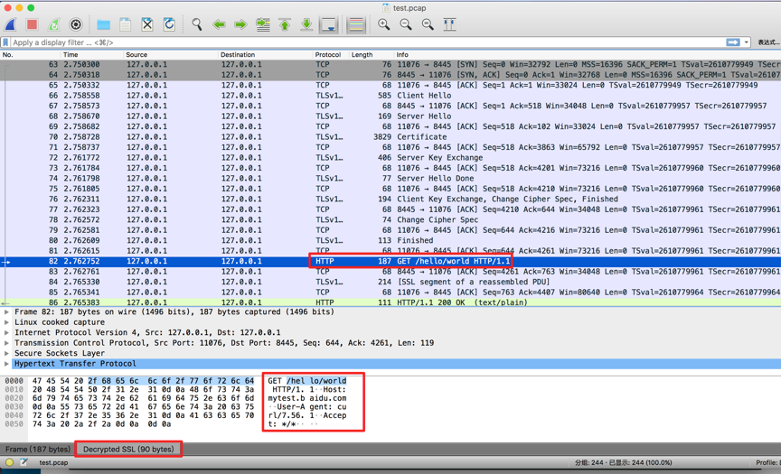

# Traffic tapping

Use packet capture and analysis tools to locate and analyze complex network problems

## Traffic capture

tcpdump example：

```bash
# tcpdump tcp port 8443 -i any -s -w test.pcap
```

## Traffic analysis

### Plaintext traffic

Use wireshark to open packet capture file.

### Ciphertext traffic

For TLS-based encrypted traffic, you can use mod_key_log and wireshark for analysis.

* Step1: Enable mod_key_log module and save the TLS session key to key.log file
  * Note：modify bfe.conf and enable mod_key_log,  See module configuration [mod_key_log](../modules/mod_key_log/mod_key_log.md) for details

```ini
[Server]
Modules = mod_key_log
```

* Step2: Set the path of the Master-Secret log file to key.log in wireshark
  * Note：Edit→Preferences→Protocols→SSL→(Pre)-Master-Secret log filename

* Step3: Use wireshark to open and decrypt the captured data


