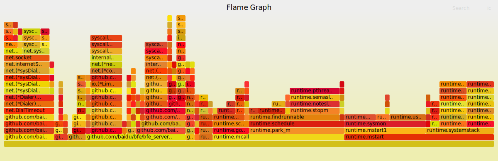

# Performance

BFE has built-in CPU profile interfaces, which can be used in conjunction with the FlameGraph tool to locate and analyze performance problems.

## Configure monitor port

Set monitor port in the BFE core configuration file (conf/bfe.conf).

```ini
[Server]
MonitorPort = 8421
```

## Tools

* FlameGragh

```bash
$ git clone https://github.com/brendangregg/FlameGraph
```

Which contains stackcollpase-go.pl and flamegraph.pl tools

## Step

* Get performance sampling data

```bash
$ go tool pprof -seconds=60 -raw -output=bfe.pprof  http://<addr>:<port>/debug/pprof/profile
```

Note: seconds=60 means capturing 60 seconds of stack samples

* Transform and draw FlameGraph

```bash
$ ./stackcollpase-go.pl bfe.pporf > bfe.flame
$ ./flamegraph.pl bfe.flame > bfe.svg
```

* Open bfe.svg in browser


