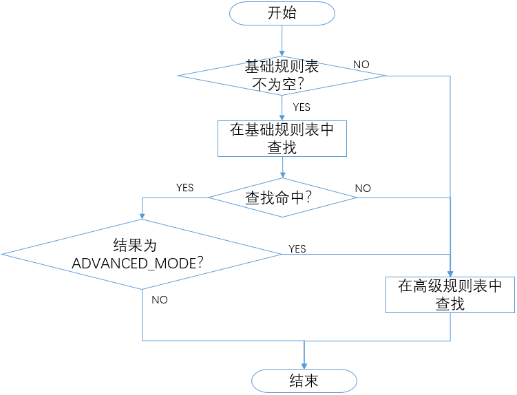

# 集群间分流

## 概述

- 在BFE的[接入转发流程](./forward_model.md)中，在确定产品线后，要进一步确定处理该请求的目标集群
- BFE为每个产品线维护一张“转发表”
- 对每个属于该产品线的请求，查询转发表，获得目标集群

## 转发表的组成

转发表包括2部分：

- **基础规则表**：由基础规则组成。使用域名(Host)和路径(Path)作为匹配条件，基础规则表中的规则按最长匹配原则进行匹配。
- **高级规则表**：由高级规则组成。使用请求中的多种信息（如host、path、header、cookie、method等）进行匹配，高级规则表中的规则按先后顺序进行顺序匹配。在高级规则表中可以设置默认规则。

基础规则表使用树形查找，匹配速度快，可以支持较大数量（几千甚至上万）转发规则的快速查找；高级规则表支持更强大的条件描述能力，但是在规则数量较多（超过100条）时会有明显的性能下降。

## 匹配顺序

BFE会按照基础规则表、高级规则表的顺序来查找，以确定目标集群。

在基础规则表中，也可以将某条规则的目标集群设置为“ADVANCED_MODE”(高级模式)，命中此规则的请求将转至高级规则表进一步匹配。

详细的匹配顺序见下图。



## 基础规则表

### 基础规则说明

基础规则表由多条“基础规则”组成。

- 基础规则的匹配条件包括域名(host)和路径(path)两个部分。
- 目的集群通过集群名称来指定，也可以设置为“ADVANCED_MODE”转至高级规则表继续匹配。

基础规则没有前后顺序关系，而是基于精确优先、最长匹配的原则。详细的匹配方式见后面的“基础规则匹配顺序”。

### 基础规则匹配条件

一条基础规则可以指定host条件或path条件，或者同时指定host条件和path条件。

host条件的描述语法遵循以下规则：

- 以"."作为域名标签元素的分割符（域名标签元素指的是由 "."分隔的host中的标签。）
- 支持“精确匹配”、“通配符匹配”和“任意匹配”
  - 精确匹配：完整的域名，如：www.test1.com
  - 通配符匹配：第一个域名标签元素为通配符"\*"表示这个描述为通配符匹配。 "\*"仅能出现一次，且仅可以表示一个域名标签元素，例如\*.test.com。而\*est.com和\*.\*.com均不符合语法。
  - 任意匹配：一种特殊的通配符匹配，可以填写单独的通配符"\*"来表示匹配任意的host值（与通配符匹配不同，任意匹配的\*可以匹配包含多个域名标签元素的host）
- 一条规则的host条件，支持多个host描述，如："www.test1.com", "\*.example.com"

示例：

| host描述  | 请求的host                             | 是否匹配？                      |
| ----------- | -------------------------------------- | ------------------------------- |
| \* | www.test1.com                          | 匹配                            |
| \*.test1.com | host.test1.com                         | 匹配                            |
| \*.test1.com | vip.host.test1.com                     | 不匹配，\* 只匹配一个域名标签元素 |
| \*.test1.com | example.com                            | 不匹配                          |
| \*.test1.com | test1.com                              | 不匹配                          |

path条件的描述语法遵循以下规则：

- 以"/"作为路径元素的分割符（路径元素指的是由 "/" 分隔符分隔的路径中的标签。）
- 除了任意匹配，均以"/"开始
- 支持“精确匹配”和“前缀匹配”
  - 精确匹配：完整的路径，如/path
  - 前缀匹配：在路径前缀后面使用"\*"来表示这个描述为前缀匹配，即从左开始对path中的路径元素逐个匹配。 "\*"仅能出现一次，且可以表示一个或多个连续的路径元素。前缀匹配的描述也可以是一个单独的"\*"。举例如下：
    - /foo/bar 这个path，条件 /\* 和 /foo/\* 均能匹配到；
    - /foo/\* 和 /foo\* 是等价的；
    - /foo/bar 这个path，不能被条件 /foo/b\* 匹配到；
    - /\*/\* 不符合path描述的语法
- 一条规则的path条件，支持多个path描述，如："/foo/bar", "/foo/cell/\*"

更多示例：

| path描述 | 请求的path | 是否匹配                                  |
| ----------- | ---------- | ----------------------------------------- |
| \* | 任何path值 | 匹配                                      |
| /           | 空值       | 不匹配                                    |
| /           | /a         | 不匹配                                    |
| /\*          | 空值       | 不匹配                                    |
| /\*          | /          | 匹配，\*可以匹配空值                       |
| /\*          | /a/        | 匹配，忽略尾部斜线                        |
| /a/b/\* (与 /a/b\* 等价) | /a/b/c     | 匹配         |
| /a/b/\* (与 /a/b\* 等价) | /a/b/c/d   | 匹配，\*可以匹配多个路径元素               |
| /a/b/\* (与 /a/b\* 等价) | /a/b       | 匹配，忽略尾部斜线，\*可以匹配空值 |
| /a/b/\* (与 /a/b\* 等价) | /a/c       | 不匹配                                    |
| /a/b/\* (与 /a/b\* 等价) | /a       | 不匹配                                    |
| /a/b\* | /a/bacon | 不匹配 |

### 基础规则匹配顺序

在基础规则表中查找时，先host条件匹配，符合host条件的规则，再进行path条件匹配：

1. 首先对host进行**精确匹配**
   - 对匹配到的规则（可能是一条或多条），再尝试匹配这些规则的path条件；
     - 若匹配path条件成功，即为命中规则；
     - 若匹配path条件未成功，则判定为未命中基础规则，转由高级规则进行匹配
2. host精确匹配未成功的，对host进行**通配符匹配**
   - 对匹配到的规则（可能是一条或多条），再尝试匹配这些规则的path条件；
     - 若匹配path条件成功，即为命中规则；
     - 若匹配path条件未成功，则判定为未命中基础规则，转由高级规则进行匹配
3. host通配符匹配未成功的，对host进行**任意匹配**
   - 对匹配到的规则（可能是一条或多条），再尝试匹配这些规则的path条件；
     - 若匹配path条件成功，即为命中规则；
     - 若匹配path条件未成功，则判定为未命中基础规则，转由高级规则进行匹配
4. 基础规则匹配结束，未命中的，转由高级规则进行匹配

其中，对于上面步骤中，对host条件匹配到的规则，进行匹配path条件时的匹配逻辑如下：

1. 首先对path进行精确匹配
2. 精确匹配未成功的，对path进行前缀匹配。前缀匹配使用最长匹配原则，即若请求的path符合多条规则的path条件，匹配到从左开始有最多路径元素的那条规则（只会是一条规则）

### 基础规则匹配示例

有四条基础规则，分别为：

- 规则1：**host条件**：\*.test1.com，**path条件**：空值，**目标集群**：StaticCluster
- 规则2：**host条件**：\*.b.test1.com，**path条件**：/interface/\* ，**目标集群**：PhpCluster
- 规则3：**host条件**：\*.b.test1.com， **path条件**：/\*， **目标集群**：StaticCluster
- 规则4：**host条件**：www.test1.com， **path条件**：/interface/d， **目标集群**：PhpCluster

收到一个请求，请求URL为vip.b.test1.com/interface/d

首先对host匹配：

1.host**精确匹配**，未匹配成功

2.host**通配符匹配**，发现请求的host(vip.b.test1.com)可以满足规则2，3的host条件（注意，规则1不匹配该请求，因为通配符"\*"只能匹配一个域名标签元素）。

继续进行path匹配：

1.path**精确匹配**，未匹配成功

2.path**前缀匹配**，发现请求的path(/interface/d)可以满足规则2和规则3的path条件，根据最长匹配原则，匹配到从左开始有最多路径元素的那条规则，即规则2。

匹配结束，在基础规则表中命中规则2。根据规则2的设置，将请求转发到集群PhpCluster。

## 高级规则表

高级规则列表由多条**有顺序**的“高级规则”组成。

- 高级规则的匹配条件使用了一个伪码描述机制“[条件表达式](../condition/condition_grammar.md)”（Condition Expression，后面简称为Condition或条件表达式）来表述。
- 目的集群通过集群名称来指定。

在查询时，对多条高级规则顺序查找：

- 基于HTTP请求中的信息，根据转发规则的匹配条件进行条件判断，符合匹配条件的为命中该转发规则。可以使用的请求信息包括：host，path，query，cookie，method等
- 只要命中任何一条转发规则，就会由此确定目的集群并结束退出。
- 高级规则表中包含“默认规则（Default）。若所有转发规则都没有命中，将执行默认规则。

## 示例

- 产品线demo，包含多种服务集群：Demo-A, Demo-B, Demo-C, Demo-D，Demo-E

- 期望的集群间分流如下：
    + 对于host为www.a.com，且path为"/a/\*" (除了"/a/b") 的请求，转发至Demo-A集群
    + 对于host为www.a.com，且path为"/a/b"的请求，转发至Demo-B集群
    + 对于其他host为\*.a.com的请求，转发至Demo-C集群
    + 对于host为www.c.com的请求，转发至Demo-D集群
    + 针对Demo-D集群，另外开启了一个灰度集群Demo-D1。如果cookie中包含deviceid，且这个cookie的值以“x”开头，则转发至Demo-D1
    + 其它请求，都发往Demo-E

- 对应以上要求，**基础规则表**的配置为：

| host条件    | path条件                     | 目标集群            |
| ----------- | --------------------------- | ------------------ |
| www.a.com   | /a/\*                       | Demo-A             |
| www.a.com   | /a/b                        | Demo-B             |
| \*.a.com    | \*                          | Demo-C             |
| www.c.com   | \*                          | ADVANCED_MODE      |

在基础规则表中，规则之间没有前后顺序。见前面关于“基础规则匹配顺序”的说明。

针对Demo-D集群上应用的灰度发布，由于需要使用cookie中的信息，所以使用ADVANCED_MODE将满足条件的请求透传到高级规则表继续处理；在不需要灰度发布的时候，在基础规则表中www.c.com对应规则的目标集群写为Demo-D即可。

- **高级规则表**的配置为：

| 匹配条件                                   | 目标集群            |
| ----------------------------------------  | ------------------ |
| req_host_in("www.c.com") && req_cookie_value_prefix_in("deviceid", "x", false) | Demo-D1             |
| req_host_in("www.c.com")                 | Demo-D              |
| default                                  | Demo-E              |

在高级规则表中，多条规则之间是有序的。需要将转发给Demo-D1的规则放在转发给Demo-D的规则的前面。

高级规则表中包含默认规则，对于没有命中其它规则的请求将被转发到Demo-E。

以上配置信息，对应的配置文件（/conf/server_data_conf/route_rule.conf）如下：

```
{
    "Version": "1.0",
    "BasicRule": {
        "demo": [
            {
                "Hostname": ["www.a.com"],
                "Path": ["/a/*"], 
                "ClusterName": "Demo-A"
            },
            {
                "Hostname": ["www.a.com"],
                "Path": ["/a/b"],
                "ClusterName": "Demo-B"
            },
            {
                "Hostname": ["*.a.com"],
                "Path": "*",
                "ClusterName": "Demo-C"
            },
            {
                "Hostname": ["www.c.com"],
                "Path": "*",
                "ClusterName": "ADVANCED_MODE"
            }
        ]
    },
    "ProductRule": {
        "demo": [
            {
                "Cond": " req_host_in(\"www.c.com\") && req_cookie_value_prefix_in(\"deviceid\", \"x\", false)",
                "ClusterName": "Demo-D1"
            },
            {
                "Cond": " req_host_in(\"www.c.com\")",
                "ClusterName": "Demo-D"
            },
            {
                "Cond": "default_t()",
                "ClusterName": "Demo-E"
            }
        ]
    }    
}
```
