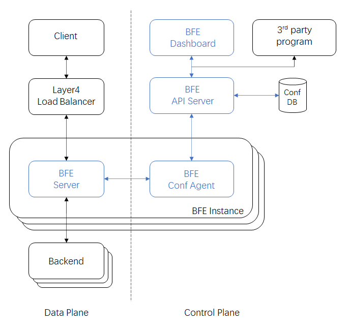

# 概览

## BFE是什么

BFE是基于百度统一接入前端开源的七层流量接入系统。

## 功能特性及优点

* 基于Golang构建

基于内存安全语言构建无缓冲区溢出安全漏洞隐患；具备异常捕获容错处理能力避免进程异常退出；兼容支持Linux/Windows/MacOS等多平台运行。

* 灵活的模块框架

内置灵活的模块框架，支持高效率定制开发第三方扩展模块。

* 面向多租户架构

基于多租户架构设计，租户之间配置相互隔离。

* 支持丰富的接入协议

支持HTTP，HTTPS，SPDY，HTTP/2，WebSocket，TLS, gRPC, FastCGI等。未来计划支持HTTP/3。

* 基于请求内容路由

支持[高级条件表达式](../condition/condition_grammar.md)定制转发规则，转发规则易于理解及维护。

* 高级负载均衡

支持全局/分布式负载均衡，实现就近访问、跨可用区容灾及过载保护等。

* 丰富的扩展模块

提供丰富的流量管理、安全防攻击、可见性等相关扩展模块。

* 一流的可见性

提供丰富详尽的监控指标；提供各类日志（服务日志/访问日志/TLS Key日志）供问题诊断、数据分析及可视化；BFE还支持请求分布式Tracing。

* 兼容适配主流生态项目

兼容适配主流四层负载均衡方案，及其它生态项目如 Kubernetes、Prometheus、Jaeger、Fluentd 等。

## 功能组件

BFE开源项目包含数据平面和控制平面的多个组件：

- 数据平面：
  - BFE Server：BFE 核心转发引擎，BFE Server 将用户流量经过内容路由、负载均衡，最终转发给合适的后端业务集群
- 控制平面：
  - [API-Server](https://github.com/bfenetworks/api-server)：对外提供 API 接口，完成 BFE 配置的变更、存储和生成
  - [Conf-Agent](https://github.com/bfenetworks/conf-agent)：配置加载组件，从 API-Server 获取最新配置，并触发 BFE Server 进行配置热加载
  - [Dashboard](https://github.com/bfenetworks/dashboard)：为用户提供了图形化操作界面，以对 BFE 的主要配置进行管理和查看

## 架构介绍

下图展示了BFE的架构及BFE生态中的一些依赖系统。

### 数据平面

用户流量经四层负载均衡设施达到 BFE Server。BFE Server 进行内容路由、负载均衡，将流量转发给合适的后端集群。关于流量接入转发的详细过程，可以进一步阅读[流量接入转发模型](forward_model.md) 。

### 控制平面

BFE 用户可通过 BFE Dashboard 或 RESTful API 管理流量接入和转发策略配置。BFE Conf Agent 会触发 BFE Server 加载最新配置。
