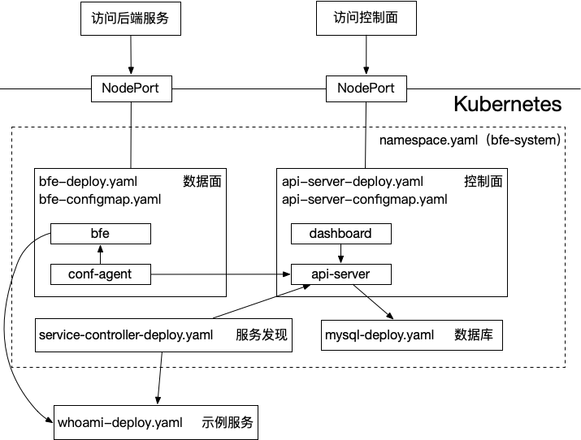

# BFE Kubernetes 部署示例

## 概述



本示例在 `bfe-system` 命名空间中演示了若干关键组件及其交互：
- 数据面（bfe 与 conf-agent）负责流量转发与接入控制；
- 控制面（api-server 与 dashboard）负责策略下发与管理；
- 服务发现（service-controller）负责发现并同步后端服务；
- 示例服务 whoami 用于验证路由；
- 组件间通过 Kubernetes Service/DNS 相互通信，如：
  - api-server.bfe-system.svc.cluster.local
  - mysql.bfe-system.svc.cluster.local

注意：
- api-server 与 MySQL 提供持久化与控制数据；
  - 示例中的 MySQL 会随清单重建并重新初始化
  - 不能直接用于生产环境


主要文件概览：

| **文件名** | **说明** |
|---|---|
| `namespace.yaml` | 命名空间定义（bfe-system） |
| `kustomization.yaml` | kustomize 资源汇总与启用/禁用项 |
| `bfe-configmap.yaml` | bfe 配置（bfe.conf、conf-agent.toml 等） |
| `bfe-deploy.yaml` | bfe 数据面 Deployment 清单 |
| `api-server-configmap.yaml` | API Server 配置（DB 连接、鉴权示例） |
| `api-server-deploy.yaml` | API Server Deployment 清单 |
| `mysql-deploy.yaml` | MySQL Deployment（示例数据库与存储配置） |
| `service-controller-deploy.yaml` | 服务发现控制器 Deployment 清单 |
| `whoami-deploy.yaml` | 示例测试服务 whoami 的 Deployment 清单 |

## 前提条件

- 版本约束：kubectl 必须支持 -k 参数
  - 建议 kubectl >= 1.20 或任意能执行 `kubectl apply -k .` 的版本。

- 集群访问权限：kubectl 能访问目标集群并有权限创建 Namespace、Deployment、Service、ConfigMap、Secret 等资源。

- 镜像可拉取：确保集群节点能拉取示例镜像。
  - 本示例通过 `kustomization.yaml` 的 `images:` 统一管理镜像地址与 tag，推荐只改这一处。
  - 如需使用镜像加速/镜像仓库（mirror），请在 `images:` 中调整 `newName` / `newTag`。

- 可选工具：若 kubectl 无内置 kustomize，请安装 kustomize 或使用带 kustomize 的 kubectl 版本。


## 部署

### 配置镜像

所有组件镜像均在 `kustomization.yaml` 的 `images:` 中集中配置。
如果你遇到镜像拉取失败（例如无法访问 ghcr），只需要修改 `images:` 的 `newName`/`newTag`，不需要逐个修改各个 `*-deploy.yaml`。

常用 mirror 配置示例（以 `ghcr.nju.edu.cn` 为例）：

```yaml
images:
  - name: ghcr.io/bfenetworks/bfe
    newName: ghcr.nju.edu.cn/bfenetworks/bfe
    newTag: v1.8.0-debug

  - name: ghcr.io/bfenetworks/api-server
    newName: ghcr.nju.edu.cn/bfenetworks/api-server
    newTag: latest

  - name: ghcr.io/bfenetworks/service-controller
    newName: ghcr.nju.edu.cn/bfenetworks/service-controller
    newTag: latest

  - name: ghcr.io/cc14514/mysql
    newName: ghcr.nju.edu.cn/cc14514/mysql
    newTag: "8"
```

> 建议只改 `newName`（仓库前缀）和 `newTag`（版本），保持 `name:` 与各个 YAML 中实际使用的镜像名字一致。

> 注意：MySQL 的镜像会同时用于 MySQL Deployment 以及 api-server 的 initContainer（用于等待数据库 schema 初始化完成），因此建议二者保持一致，且镜像内需包含 `mysql`/`mysqladmin` 客户端。

### 部署 bfe 服务（数据面、控制面、服务发现）

```bash
cd examples/kubernetes
kubectl apply -k .
```

### 部署测试服务（验证 bfe 服务启动成功后）

```bash
cd examples/kubernetes
kubectl apply -f whoami-deploy.yaml 
```

> whoami 示例部署在 `default` 命名空间（见 `whoami-deploy.yaml`），不包含在 `kubectl apply -k .` 的资源集合中。
> 如果 whoami 镜像也需要走 mirror，请直接修改 `whoami-deploy.yaml` 的 `image:`。

## 验证

- 检查命名空间、Pod 与服务状态：

```bash
[root@iTM ~]# kubectl get ns bfe-system
NAME         STATUS   AGE
bfe-system   Active   29h

[root@iTM ~]# kubectl -n bfe-system get pods
NAME                                      READY   STATUS    RESTARTS   AGE
api-server-655fdffbf-hwvgw                1/1     Running   0          29h
bfe-85f4d45ddf-4xwdz                      1/1     Running   0          29h
bfe-85f4d45ddf-srnxd                      1/1     Running   0          29h
bfe-service-controller-6867d57767-92b5m   1/1     Running   0          29h
mysql-d768d5d4d-fj4j5                     1/1     Running   0          29h

[root@iTM ~]# kubectl -n bfe-system get service
NAME         TYPE        CLUSTER-IP      EXTERNAL-IP   PORT(S)                                        AGE
api-server   NodePort    10.105.122.39   <none>        8183:30083/TCP,8284:30786/TCP                  29h
bfe          NodePort    10.108.55.8     <none>        8080:30080/TCP,8443:30443/TCP,8421:30421/TCP   29h
mysql        ClusterIP   None            <none>        3306/TCP                                       29h
[root@iTM ~]#
```

- 登录 dashboard:
  - 浏览器访问 http://{NodeIP}:30083
  - 默认账号/密码：admin/admin

## 清理

- 清理测试服务

```bash
cd examples/kubernetes
kubectl delete -f whoami-deploy.yaml
```

建议删除顺序：先删除 `whoami`，再删除 `bfe-system`。
原因：`service-controller` 会对 `whoami` 资源（通常是 `default` 命名空间的 Service）添加 `finalizers` 做清理保护；如果你先删掉 `bfe-system`（从而删掉 `service-controller`），再删 `whoami`，finalizer 可能无法被移除，导致 `kubectl delete -f whoami-deploy.yaml` 卡住。

- 清理 bfe 服务（数据面、控制面、服务发现）

```bash
cd examples/kubernetes
kubectl delete -k . 
```

说明：`kubectl delete -k .` 只会删除 `kustomization.yaml` 的 `resources:` 中的资源（本示例主要是 `bfe-system` 命名空间内的组件 + `namespace.yaml`）。
`whoami` 在 `default` 命名空间，不在 `-k` 资源集合里，因此不会阻塞 `kubectl delete -k .`。

如果你遇到的是删除 `whoami` 卡住（而不是 `-k` 卡住），优先检查 `default` 命名空间里 `whoami` 相关资源是否存在 finalizers：

```bash
kubectl get svc whoami -n default -o jsonpath='{.metadata.finalizers}' && echo
kubectl get deploy whoami -n default -o jsonpath='{.metadata.finalizers}' && echo
```

在确认可以强制清理的情况下，可以移除 whoami 的 finalizers（谨慎使用）：

```bash
kubectl patch svc whoami -n default --type=merge -p '{"metadata":{"finalizers":[]}}'
kubectl patch deploy whoami -n default --type=merge -p '{"metadata":{"finalizers":[]}}'
```

如果 `kubectl delete -k .` 卡住（常见于 `bfe-system` namespace 进入 Terminating），通常是 `bfe-system` 命名空间内仍有资源带 `finalizers`，而负责移除 finalizer 的 controller 已停止或清理未完成。

```bash
kubectl describe ns bfe-system
kubectl get ns bfe-system -o jsonpath='{.spec.finalizers}' && echo
```

进一步定位卡住的对象（示例）：

```bash
kubectl api-resources --verbs=list --namespaced -o name \
  | xargs -n 1 kubectl get -n bfe-system --ignore-not-found --show-kind --no-headers
```

在确认可以强制清理的情况下，可以手工移除 finalizers（谨慎使用）：

```bash
kubectl patch ns bfe-system --type=merge -p '{"spec":{"finalizers":[]}}'
```

- 按需删除单个资源：

```bash
# bfe 
kubectl -n bfe-system delete -f service-controller-deploy.yaml
kubectl -n bfe-system delete -f api-server-deploy.yaml
kubectl -n bfe-system delete -f api-server-configmap.yaml
kubectl -n bfe-system delete -f mysql-deploy.yaml
kubectl -n bfe-system delete -f bfe-deploy.yaml
kubectl -n bfe-system delete -f bfe-configmap.yaml

# whoami
kubectl delete -f whoami-deploy.yaml
```

## 重启 

示例中 MySQL Pod 每次重启时会重新初始化并丢失已有数据,
若希望在仅更新其它 Pod（例如修改配置后 `kubectl apply -k .`）时保留已有数据库,
可在 `examples/kubernetes/kustomization.yaml` 中临时注释或移除 `mysql-deploy.yaml`。
然后再执行 `kubectl apply -k .` 进行重启。

## 关键配置 

### 数据面 bfe

- 镜像：通过 `kustomization.yaml` 的 `images:` 统一替换，推荐使用带 tag 的镜像。

- 配置挂载：bfe-configmap.yaml 包含 bfe.conf 与 conf-agent.toml，确认 volumeMounts 的容器路径与配置文件中引用路径一致。

- 监控端口：示例暴露 8421，用于健康与监控接口，可通过 Service 或 kubectl port-forward 验证。

- 服务端口：示例暴露 8080，NodePort 30080，用于对外提供服务。

### 控制面 api-server 与 mysql

- 数据库连接：api-server-configmap.yaml 中 DB_HOST / DB_PORT / DB_USER / DB_PASSWORD（示例为明文）。
  - 在生产环境请改为 Kubernetes Secret。

- 鉴权 Token：示例 Token 已经预置在 `api-server-configmap.yaml` 与 `service-controller-deploy.yaml` 中。
  - 生产环境必须使用 Secret、短期或动态凭证。
  - 生产环境需要预先在控制面 [dashboard](https://github.com/bfenetworks/dashboard/blob/develop/README.md) 中创建 Token。

- MySQL 存储：mysql-deploy.yaml 为方便一键部署快速搭建，使用了 emptyDir 卷，重启 pod 后数据会丢失，不适用于生产环境。
  - 生产必须使用 PV/PVC、指定 StorageClass，并配置备份策略。

- MySQL 初始化：示例通过 Job 执行 `db_ddl.sql` 初始化表结构；api-server 在启动前会通过 initContainer 等待 `open_bfe` 中表创建完成。
  - 如环境启动较慢，可在 mysql-deploy.yaml 中调大 `startupProbe` 的容忍时间（例如增大 `failureThreshold`）。


- 更多请参见：[dashboard](https://github.com/bfenetworks/dashboard/blob/develop/README.md)

### 服务发现 service-controller 与 whoami

- 发现规则：service-controller-deploy.yaml 中 args 或 env 定义发现策略、标签选择器或 API Server 地址，按需调整以匹配你的服务标签/注解。

- whoami 端口：whoami-deploy.yaml 中 spec.template.spec.containers[].ports 必须与对应 Service 的端口一致。

- 更多请参见：[service-controller](https://github.com/bfenetworks/service-controller/blob/main/README.md)

